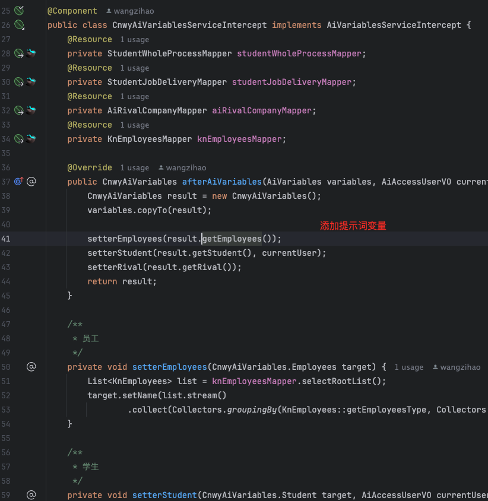

# ai-assistant

## 介绍

AI助手jar包，可二次开发复用 (基于langchain4j的java8版本开发)

*   **表结构关系-在线文档：** [https://zihaoapi.cn/static/doc/ai.html](https://zihaoapi.cn/static/doc/ai.html)
*   **GitHub 仓库：** [https://github.com/wangzihaogithub/ai-assistant](https://github.com/wangzihaogithub/ai-assistant)
*   **Maven Central：** [](https://search.maven.org/search?q=g:com.github.wangzihaogithub%20AND%20a:ai-assistant)

### Maven 依赖

```xml
<!-- https://github.com/wangzihaogithub/ai-assistant -->
<!-- https://mvnrepository.com/artifact/com.github.wangzihaogithub/ai-assistant -->
<dependency>
    <groupId>com.github.wangzihaogithub</groupId>
    <artifactId>ai-assistant</artifactId>
    <version>1.0.1</version>
</dependency>

<!-- Required Dependencies -->
<dependency>
  <groupId>dev.langchain4j</groupId>
  <artifactId>langchain4j</artifactId>
  <version>0.35.0</version>
</dependency>
<dependency>
  <groupId>dev.langchain4j</groupId>
  <artifactId>langchain4j-open-ai</artifactId>
  <version>0.35.0</version>
</dependency>
<dependency>
  <groupId>com.squareup.okhttp3</groupId>
  <artifactId>okhttp-sse</artifactId>
  <version>3.14.9</version>
</dependency>
```

## 模块结构

```
├── entity (数据实体)
├── dao (数据访问)
├── enums (业务自定义枚举)
├── serviceintercept (业务拦截器)
├── exception (明确区分的各种异常)
├── platform (平台agent接口 [阿里百炼等])
└── service (业务核心)
    ├── accessuser (用户访问授权)
    ├── jsonschema (json模型)
    ├── text (文本模型)
    │   ├── reasoning (思考)
    │   ├── acting (行动)
    │   ├── memory (记忆 [长期-片段，长期-变量，短期-消息记录])
    │   ├── chat (聊天 [终止记录，重新回答记录，消息记录，思考记录，联网记录])
    │   ├── nlu (自然语言理解 [文本分类、文本聚类、命名实体识别])
    │   ├── rerank (文本重排序)
    │   ├── embedding (向量模型)
    │   ├── repository (存储 [存数据库，存本地，消息截断，token截断])
    │   ├── sseemitter (sse推送)
    │   ├── tools (工具)
    │   └── variables (变量)
└── AiApplication.class (应用入口)
```

## 数据库实体 (Entity)

*   **[AiAssistant.java](src%2Fmain%2Fjava%2Fcom%2Fgithub%2Faiassistant%2Fentity%2FAiAssistant.java)**
  *   智能体配置表，对应页面中的一个智能体
*   **[AiAssistantFewshot.java](src%2Fmain%2Fjava%2Fcom%2Fgithub%2Faiassistant%2Fentity%2FAiAssistantFewshot.java)**
  *   少样本提示表
*   **[AiAssistantKn.java](src%2Fmain%2Fjava%2Fcom%2Fgithub%2Faiassistant%2Fentity%2FAiAssistantKn.java)**
  *   知识库的配置
*   **[AiAssistantMstate.java](src%2Fmain%2Fjava%2Fcom%2Fgithub%2Faiassistant%2Fentity%2FAiAssistantMstate.java)**
  *   定义长期的已知记忆变量
*   **[AiChat.java](src%2Fmain%2Fjava%2Fcom%2Fgithub%2Faiassistant%2Fentity%2FAiChat.java)**
  *   每个聊天会话，对应一条记录
*   **[AiChatAbort.java](src%2Fmain%2Fjava%2Fcom%2Fgithub%2Faiassistant%2Fentity%2FAiChatAbort.java)**
  *   用户每次点击终止按钮，对应一条记录
*   **[AiChatClassify.java](src%2Fmain%2Fjava%2Fcom%2Fgithub%2Faiassistant%2Fentity%2FAiChatClassify.java)**
  *   问题分类表，用户每次提问，对应一条记录
*   **[AiChatHistory.java](src%2Fmain%2Fjava%2Fcom%2Fgithub%2Faiassistant%2Fentity%2FAiChatHistory.java)**
  *   用户聊天记录
*   **[AiChatReasoning.java](src%2Fmain%2Fjava%2Fcom%2Fgithub%2Faiassistant%2Fentity%2FAiChatReasoning.java)**
  *   聊天大模型思考主表
*   **[AiChatReasoningPlan.java](src%2Fmain%2Fjava%2Fcom%2Fgithub%2Faiassistant%2Fentity%2FAiChatReasoningPlan.java)**
  *   聊天大模型思考后拆分的任务
*   **[AiChatWebsearch.java](src%2Fmain%2Fjava%2Fcom%2Fgithub%2Faiassistant%2Fentity%2FAiChatWebsearch.java)**
  *   聊天大模型联网搜索内容
*   **[AiChatWebsearchResult.java](src%2Fmain%2Fjava%2Fcom%2Fgithub%2Faiassistant%2Fentity%2FAiChatWebsearchResult.java)**
  *   聊天大模型联网搜索结果
*   **[AiEmbedding.java](src%2Fmain%2Fjava%2Fcom%2Fgithub%2Faiassistant%2Fentity%2FAiEmbedding.java)**
  *   向量模型缓存表，加速RAG
*   **[AiJsonschema.java](src%2Fmain%2Fjava%2Fcom%2Fgithub%2Faiassistant%2Fentity%2FAiJsonschema.java)**
  *   json大模型智能体配置
*   **[AiMemory.java](src%2Fmain%2Fjava%2Fcom%2Fgithub%2Faiassistant%2Fentity%2FAiMemory.java)**
  *   聊天记忆表
*   **[AiMemoryError.java](src%2Fmain%2Fjava%2Fcom%2Fgithub%2Faiassistant%2Fentity%2FAiMemoryError.java)**
  *   聊天错误表
*   **[AiMemoryMessage.java](src%2Fmain%2Fjava%2Fcom%2Fgithub%2Faiassistant%2Fentity%2FAiMemoryMessage.java)**
  *   聊天记忆消息表
*   **[AiMemoryMessageKn.java](src%2Fmain%2Fjava%2Fcom%2Fgithub%2Faiassistant%2Fentity%2FAiMemoryMessageKn.java)**
  *   聊天记忆消息使用了哪些知识库
*   **[AiMemoryMessageTool.java](src%2Fmain%2Fjava%2Fcom%2Fgithub%2Faiassistant%2Fentity%2FAiMemoryMessageTool.java)**
  *   聊天记忆消息使用了哪些工具
*   **[AiMemoryMstate.java](src%2Fmain%2Fjava%2Fcom%2Fgithub%2Faiassistant%2Fentity%2FAiMemoryMstate.java)**
  *   长期的记忆片段与记忆变量
*   **[AiQuestionClassify.java](src%2Fmain%2Fjava%2Fcom%2Fgithub%2Faiassistant%2Fentity%2FAiQuestionClassify.java)**
  *   定义聊天问题的分类
*   **[AiQuestionClassifyAssistant.java](src%2Fmain%2Fjava%2Fcom%2Fgithub%2Faiassistant%2Fentity%2FAiQuestionClassifyAssistant.java)**
  *   根据问题选择适合的智能体，不关联分类表示该问题使用原智能体
*   **[AiTool.java](src%2Fmain%2Fjava%2Fcom%2Fgithub%2Faiassistant%2Fentity%2FAiTool.java)**
  *   定义工具调用
*   **[AiToolParameter.java](src%2Fmain%2Fjava%2Fcom%2Fgithub%2Faiassistant%2Fentity%2FAiToolParameter.java)**
  *   定义工具所需参数
*   **[AiVariables.java](src%2Fmain%2Fjava%2Fcom%2Fgithub%2Faiassistant%2Fentity%2FAiVariables.java)**
  *   自定义变量，供提示词里编写
*   **[KnSettingWebsearchBlacklist.java](src%2Fmain%2Fjava%2Fcom%2Fgithub%2Faiassistant%2Fentity%2FKnSettingWebsearchBlacklist.java)**
  *   网络内容黑名单。针对网络搜索结果，过滤掉不想要的内容

## 业务开发指南

### 1. 生命周期 (基于生命周期进行业务需求开发)

*   **触发业务逻辑:** 
*   **消费业务逻辑:** 
*   **系统生命周期:** 

### 2. 逻辑控制

*   

### 3. 会话用户

*   

### 4. 追加提示词变量

*   